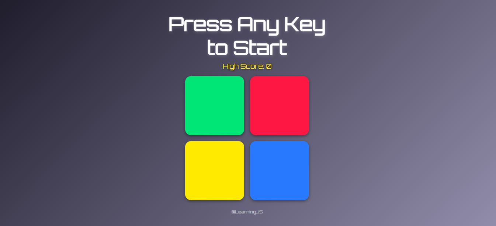

# Simon Game 🎮

A classic **Simon memory game** built using **HTML**, **CSS**, and **JavaScript**.  
Test your memory skills by repeating the sequence of colors that grows longer each round!

## 🔗 Live Demo
[Play it here](https://Aldin-K-Immanuel.github.io/simon-game)

## 🚀 Features
- Smooth color flashes with animation
- Responsive layout for mobile & desktop
- High score tracking
- Keyboard and click controls

## 📸 Preview
